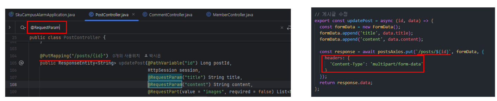

[[API 명세서↗️]](https://github.com/MyNameSieun/skuCampusAlarm-back)

 

## API 명세서에 파일 업로드나 특정 요청 형식이 명시되어 있지 않을 경우,  다음과 같은 방법을 통해 요청 형식을 확인할 수 있다.

> ① Spring Controller에서 @RequestParam 검색

`@RequestParam`은 주로 폼 데이터와 파일 업로드를 처리하는 데 사용된다. 이를 통해 요청의 형식을 추측할 수 있다.

> ② 요청의 Content-Type 설정

`@RequestParam`이 사용된 경우, 클라이언트는 반드시 요청의 `Content-Type`을 `multipart/form-data`로 설정해야 한다.

> ③ 백엔드 코드가 없을 경우

- 백엔드 개발자에게 요청 시 어떤 형식의 데이터를 보내야 하는지 확인해야한다.
- 파일 업로드가 필요한지, JSON 형식이 필요한지 등을 물어보고, 이에 맞는 요청 형식을 설정하면 된다.

